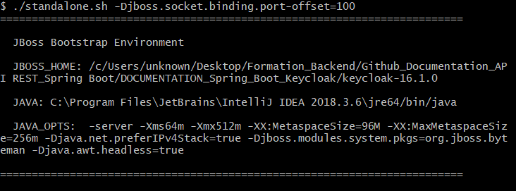
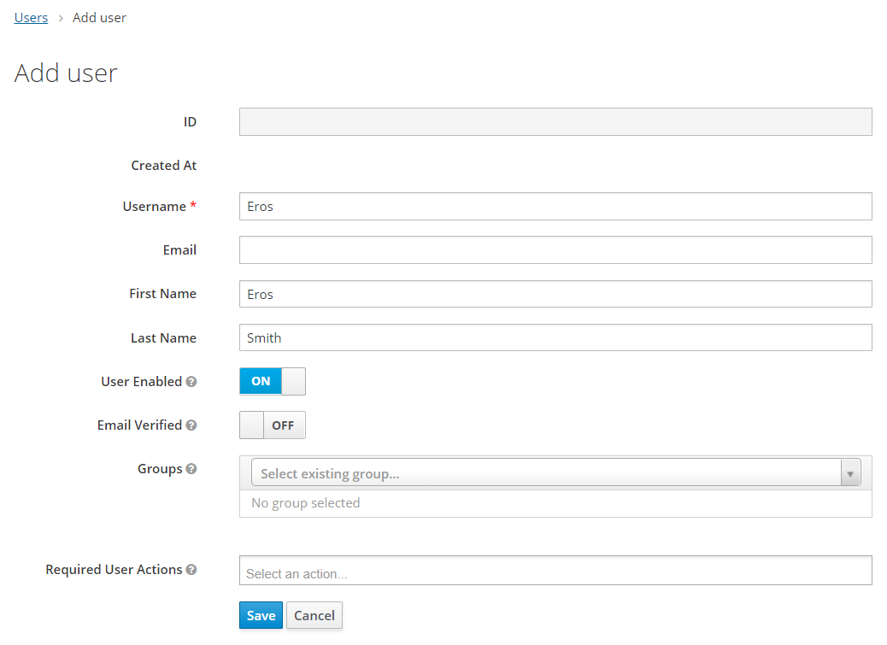

# Spring Boot Rest Api avec Keycloak - Playlists
Dans ce tutoriel, nous allons utiliser la console d'administration de Keycloak pour la configuration et la connexion à Spring Boot à l'aide de l'adaptateur client Keycloak.

##### Spring Boot
Spring Boot est un projet Spring qui facilite le processus de configuration et de publication des applications.

En suivant des étapes simples, vous pourrez exécuter votre premier projet.

##### API REST (Representational State Transfer Application Program Interface)
Il se base sur le protocole **HTTP** pour transférer des informations. 
Un client lance une requête HTTP, et le serveur renvoie une réponse à travers plusieurs méthodes dont les plus utilisées sont : **POST**, **GET**, **PUT** et **DELETE**.

##### Keycloak
- Keycloak est un outil open source de gestion des identités, d'authentification et d'accès.
- Il est utilisé principalement pour l'authentification unique (**SSO - Single Sign On**)
- Les utilisateurs s'authentifient avec **Keycloak** c'est à dire avec une application individuelle signifie que votre application ne gère pas les formulaires de connexion. 

## Configuration d'un serveur Keycloak

##### 1. Téléchargement et installation de Keycloak
~ Télécharger [Keycloak](https://www.keycloak.org/downloads) à partir de la source officielle.

~ Une fois que le fichier zip est téléchargé, nous pouvons décompresser et démarrer Keycloak depuis le terminal :
```
cd keycloak-16.1.0
./standalone.sh -Djboss.socket.binding.port-offset=100
```


Par la suite, nous ouvrons le navigateur et visitons http://localhost:8180 . Nous serons redirigés vers http://localhost:8180/auth pour créer une connexion administrative :


Maintenant nous créons un utilisateur administrateur : saisir le username, password et la confirmation de password (exemple : admin/admin).


Puis nous accédons à la **Administration console**


##### 2. Définition de mots clés de Keycloak
* **Admin Console** : Interface graphique Web où vous pouvez "cliquer" sur toutes les configurations requises par votre instance pour fonctionner comme vous le souhaitez. 

* **Users** : Entités capables de se connecter au système protégé. Ils ont un ensemble d'attributs modifiables et peuvent faire partie d'un groupe et/ou se voir attribuer des rôles spécifiques.

* **Role** : Un type ou une catégorie d'utilisateur qui existe au sein d'une organisation. Les applications se basent souvent sur des rôles pour restreindre l'accès aux ressources.  

* **Groups** : Entités utilisées pour gérer un ensemble d'utilisateurs. Comme pour les utilisateurs, les groupes ont des attributs modifiables et vous pouvez également attribuer des rôles à un groupe. Les utilisateurs qui deviennent membres d'un groupe héritent de leurs attributs et rôles.

* **Realm** : Un domaine gère un ensemble d'utilisateurs, d'informations d'identification, de rôles et de groupes. Un utilisateur appartient et se connecte à un domaine. Les domaines sont isolés les uns des autres et ne peuvent gérer et authentifier que les utilisateurs qu'ils contrôlent.

* **Client** : Les entités qui peuvent demander à Keycloak d'authentifier un utilisateur. Le plus souvent, les clients sont des applications et des services qui souhaitent utiliser Keycloak pour se sécuriser. Les clients peuvent également être des entités souhaitant demander des informations d'identité ou un jeton d'accès afin de pouvoir invoquer en toute sécurité d'autres services sécurisés par Keycloak.

* **Identity Token** : Un Jeton  d'identité fournissant des informations d'identité sur l'utilisateur. Fait partie de la spécification OpenID Connect.

* **Access Token** : Un jeton d'accès qui peut être fourni dans le cadre d'une requête HTTP. 

##### 3. Création d'un realm
* Cliquer sur le bouton "Add realm"


* Nous donnons un nom au realm : **PlaylistKeycloak** puis vous appuyez sur le bouton "Create".


##### 4. Création d'un client
* Accédez au espace client et appuyez sur le bouton "Create".


* Remplissez le Client ID input **playlist-keycloak-client** et puis vous appuyez sur le bouton "Save".


* Ensuite, nous devons également mettre à jour un champ URI de redirection valide et ajouter une URL valide de notre application.
Et puis vous appuyez sur le bouton "Save".


##### 5. Création d'un rôle
* Accédez à la section Rôles pour ajouter le rôle. Juste pour mentionner que Keycloak propose un contrôle d'accès basé sur les rôles en tant que service d'autorisation. Et Chaque utilisateur doit avoir un rôle.


* Donnez un le nom du rôle : **Admin**


##### 6. Création d'un User
* Accédez à la section Users pour ajouter un nouveau utilisateur.


* Ajoutez les informations nécessaires et appuyez sur le bouton "Save". 


* Donnez à cet utilisateur un mot de passe et mettre l'option **Temporary** à false, puis appuyez sur le bouton "Set Password"


* Accédez à l'onglet "**Role Mappings**" pour donner à cet utilisateur un rôle : **ROLE_ADMIN**.


## Configuration de l'application Spring Boot
Dans Ce tutorial, nous allons mettre l'accent seulement sur la configuration de keycloak dans un projet Spring Boot.

Pour plus de détails sur la configuration de base de projet Spring Boot, vous devez accéder au lien suivant : [projet SpringBoot_DataJpa_repository](https://github.com/hendchaouali/spring-boot-rest-api-jpa-data).


##### Outils utilisés : 
* Java 8
* IDE Intellij IDEA
* Spring Boot 2.5.7 (avec Spring Web MVC, Spring Data JPA et Spring Security)
* PostgreSQL
* H2 in-memory Database
* Lombok 1.18.22
* Maven 4.0.0


## Initialisation du projet
Pour amorcer une application Spring Boot , nous pouvons démarrer le projet à partir de zéro avec notre IDE préféré, ou simplement utiliser un autre moyen qui facilite la vie : [SpringInitializr](https://start.spring.io/)

Initialement, nous avons choisi les dépendances suivantes : Spring web, Spring Data JPA, Spring Security, Validation, Lombok et PostgreSQL Driver.


## Structure du projet
L'image ci-dessous montre la structure finale du projet


* **Pom.xml**

Pour ce projet, nous aurons besoin de :
* **Spring Boot Adapter** pour tirer parti de ses fonctionnalités de configuration automatique pour Spring Boot.

* **Spring Security Adapter** pour utiliser Keycloak comme fournisseur d'authentification pour Spring Security.

==> **keycloak-spring-boot-starter** comprend les deux, donc nous n'avons besoin de rien d'autre que cela.

Ajoutez ces deux dépendances dans le fichier **pom.xml**.

```
<dependency>
    <groupId>org.springframework.boot</groupId>
    <artifactId>spring-boot-starter-security</artifactId>
</dependency>
<dependency>
    <groupId>org.keycloak</groupId>
    <artifactId>keycloak-spring-boot-starter</artifactId>
</dependency>
```

Nous devons également garantir que la dépendance est résolue avec succès. Pour cette raison, nous devons également ajouter la dépendance "**org.keycloak.bom.keycloak-adapter-bom**" à la section de gestion des dépendances

```xml
<dependencyManagement>
    <dependencies>
        <dependency>
            <groupId>org.keycloak.bom</groupId>
            <artifactId>keycloak-adapter-bom</artifactId>
            <version>16.1.0</version>
            <type>pom</type>
            <scope>import</scope>
        </dependency>
    </dependencies>
</dependencyManagement>
```

## La configuration de Keycloak

* Modifiez le fichier de configuration **application.properties**

```yaml
# URL to your Keycloak instance
keycloak.auth-server-url = http://localhost:8180/auth/

# name of the realm used to hold users’ data of our application
keycloak.realm = PlaylistKeycloak

# name of the client which our Spring Boot application will use to integrate with
keycloak.resource = playlist-keycloak-client

# to send credentials to the Keycloak server
keycloak.public-client=true

```
##### 1. Créez La classe **KeycloakSecurityConfig**
- Est une classe de configuration pour la configuration de sécurité Keycloak.
   
- Etend la classe **KeycloakWebSecurityConfigurerAdapter : est une classe de base utile pour construire une instance WebSecurityConfigurer fournie par Keycloak**.
   
- L' annotation **@KeycloakConfiguration** : fournit une configuration Spring Security basée sur Keycloak.
```java
@KeycloakConfiguration
public class KeycloakSecurityConfig extends KeycloakWebSecurityConfigurerAdapter {
  
   //Configuration
   
}
```

##### 2. Enregistrer Keycloak en tant que fournisseur d'authentification (Authentication Provider)
Dans la méthode **configureGlobal**, nous nous enregistrons **KeycloakAuthenticationProvider** auprès du gestionnaire d'authentification. 

De cette manière, Keycloak sera responsable de fournir des services d'authentification.

Spring Security a une convention pour gérer les rôles de sécurité dans un format tel que ROLE_ADMIN. C'est pour cela :

Nous devons préfixer tous les rôles enregistrés dans Keycloak avec le préfixe "**ROLE_**" et nous pouvons même mettre le nom complet du rôle en majuscule.
```
@Autowired
public void configureGlobal(AuthenticationManagerBuilder auth){
 
    SimpleAuthorityMapper grantedAuthorityMapper = new SimpleAuthorityMapper();
    grantedAuthorityMapper.setPrefix("ROLE_");
    grantedAuthorityMapper.setConvertToUpperCase(true);
 
    KeycloakAuthenticationProvider keycloakAuthenticationProvider = keycloakAuthenticationProvider();
    keycloakAuthenticationProvider.setGrantedAuthoritiesMapper(grantedAuthorityMapper);
    auth.authenticationProvider(keycloakAuthenticationProvider);
}

```

##### 3. Utilisez la configuration Keycloak définie dans application.properties
À partir de Keycloak Spring Boot Adapter 7.0.0, en raison de certains problèmes, la découverte automatique de la configuration Keycloak à partir du fichier application.properties(ou application.yml) ne fonctionnera pas. 

Pour surmonter ce problème, nous devons définir un bean **KeycloakSpringBootConfigResolver**

```
 @Bean
    public KeycloakSpringBootConfigResolver keycloakConfigResolver() {
        return new KeycloakSpringBootConfigResolver();
    }
```

##### 4. Définir une stratégie d'authentification de session

**RegisterSessionAuthenticationStrategy** :
- Est utilisé pour des applications publiques ou confidentielles

- Enregistre une session utilisateur après une authentification réussie.
```
 @Bean
    @Override
    protected SessionAuthenticationStrategy sessionAuthenticationStrategy() {
        return new RegisterSessionAuthenticationStrategy(new SessionRegistryImpl());
    }
```

##### 5. Définir des stratégies de sécurité d'accès basées sur les rôles

Jusqu'à présent, nous avons effectué toute la configuration nécessaire pour que Spring Security fonctionne de manière transparente avec Keycloak.

Cette étape consiste à définir certaines contraintes de sécurité pour les points de terminaison de l'application.
 
Spring Security active par défaut la protection CSRF (**cross-site request forgery**) afin d'exécuter les requêtes POST et PUT il vaut mieux de le désactiver.
```
@Override
    protected void configure(HttpSecurity http) throws Exception{

        super.configure(http);
        http
                .csrf().disable()
                .authorizeRequests()
                .antMatchers("/api/*")
                .hasRole("ADMIN");
    }
```

Les politiques d'accès pour nos points de terminaison d'application sont :

* **/api/*** : L'utilisateur doit être authentifié et avoir le rôle "**Admin**" pour exécuter toutes les requêtes qui commence par "/api/"

* La version finale de la classe **KeycloakSecurityConfig**
```java
@KeycloakConfiguration
public class KeycloakSecurityConfig extends KeycloakWebSecurityConfigurerAdapter {

    @Autowired
    public void configureGlobal(AuthenticationManagerBuilder auth){

        SimpleAuthorityMapper grantedAuthorityMapper = new SimpleAuthorityMapper();
        grantedAuthorityMapper.setPrefix("ROLE_");
        grantedAuthorityMapper.setConvertToUpperCase(true);

        KeycloakAuthenticationProvider keycloakAuthenticationProvider = keycloakAuthenticationProvider();
        keycloakAuthenticationProvider.setGrantedAuthoritiesMapper(grantedAuthorityMapper);
        auth.authenticationProvider(keycloakAuthenticationProvider);
    }

    @Bean
    public KeycloakSpringBootConfigResolver keycloakConfigResolver() {
        return new KeycloakSpringBootConfigResolver();
    }


    @Bean
    @Override
    protected SessionAuthenticationStrategy sessionAuthenticationStrategy() {
        return new RegisterSessionAuthenticationStrategy(new SessionRegistryImpl());
    }

    @Override
    protected void configure(HttpSecurity http) throws Exception{

        super.configure(http);
        http
                .csrf().disable()
                .authorizeRequests()
                .antMatchers("/api/*")
                .hasRole("ADMIN");
    }

}
```

## Utilisation de l'application
* Assurez-vous que le serveur Keycloak est déjà démarré

* Démarrez l'application Spring. Par défaut, il sera disponible sur http://localhost:8080.

##### 1. Test avec Navigateur
* Collez l'URL dans le navigateur (test de l'interface utilisateur) : http://localhost:8080/api/songs

* Il nous redirigera vers la page de connexion Keycloak. 

* Nous devons par la suite saisir le username et le password.


##### 2. Test avec Postman
Vous trouvez le fichier postman sous "**resources/postman**"

* L'authentification par "**Bearer Token**".

 

Dans l'onglet Test de postman, il faut créer une variable "**token**" qui va prendre la valeur d'access_token

 

Au niveau de "**Headers**" de la requête **getSongs**, il faut mettre le key **Authorization** avec le token sauvegardé dans la variable d'environnement

* **Sans Authorization**

 

* **Avec Authorization**

 

